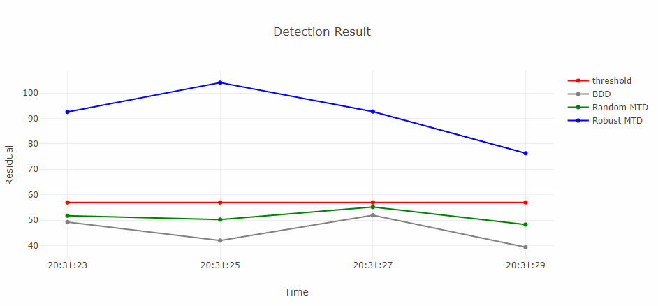

# RMTD: Robust Moving Target Defence Against False Data Injection Attacks in Power Grids

*Real-time detection performance.*

This repo contains the code and extra simulation results supporting the paper 'Robust Moving Target Defence Against False Data Injection Attacks in Power Grids' by [Wangkun Xu](https://www.linkedin.com/in/wangkun-xu/), [Imad M. Jaimoukha](https://www.imperial.ac.uk/people/i.jaimouka), and [Fei Teng](https://www.imperial.ac.uk/people/f.teng). The authors are with the [Control and Power Group](https://www.imperial.ac.uk/electrical-engineering/research/control-and-power/), Dept. of EEE, Imperial College London.

## Installation

This project requires Python packages to run. The testing OS is Windows.

1. Install the latest version [Anaconda](https://www.anaconda.com/) to your OS.
2. Create a new env in Anaconda Prompt by `conda create -n robust-mtd python=3.8.0`.
3. Direct to the env by `conda activate robust-mtd`.
4. Install all requirements by `conda install --file requirements.txt`.
5. Download everything to your PC in `your_path` and redirect to your path by `cd your_path`.

## Packages

### PYPOWER

[POPOWER](https://github.com/rwl/PYPOWER) is a power flow and optimal power flow solver. It is part of MATPOWER to the Python programming language. We will use PYPOWER as the environment to build the system matrices, implement attacks and implement the MTD.

### SciPy

[SciPy](https://scipy.org/) provides algorithms for optimization, integration, interpolation, eigenvalue problems, algebraic equations, differential equations, statistics and many other classes of problems. In specific, we use the open source optimization solve 'Sequential Least Squares Programming (SLSQP)' to solve the nonlinear programming problem.

